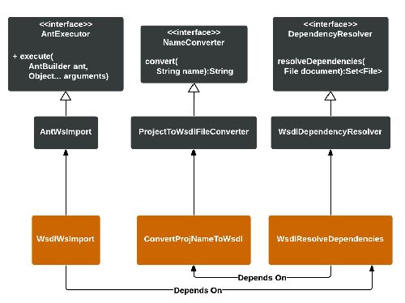

# Plugin Objective

I was frustrated using web services and trying to package a war.  I
would have to have all the knowledge of what wsdl I was using for a project, and
then follow the trail to see what xsd's and/or other wsdl's it projects WSDL
depended on. **OR** if I was lazy I would just say get all xsds at the top level
folder.  Lazy usually won, and led to bloated WARs.

Schema organization on certain projects were terrible at best.  Lots of
duplicated schemas.  Lots of duplicated generated source files as well.  Almost
0 episode binding going on.

There was a lot of copypasta for at least the ant `wsimport` task.  And even
before there was a plugin, I wrote some inline code to help, and then had to
copy that around to a different project or two.

I think this plugin solves these problems.

## Requirements

1. To find the dependencies at `build` or `package` time, the documents need to
   be parsed for dependencies, and then dependencies of those dependencies,
   until you have all of the dependencies resolved. This results in some some
   set of dependent `wsdl` and `xsd` related files for a project.

2. These dependencies  need to be packaged into a `war` artifact so they can be
   deployed without a thought to some App server.


## Slurping Documents with Groovy XmlSlurper

### Slurping XSD Documents

xsd dependencies are found under the root
element of the document.

```xsd
<xsd>
  <xsd:import schemaLocation="some_RELATIVE_location"/>
  <xsd:include schemaLocation="some_RELATIVE_location_2"/>
  <other stuff after>
</xsd>
```

The only important parts are the `schemaLocation`'s. :)

### Slurping WSDL Documents

`wsdl` documents find their wsdl imports at

```wsdl
<wsdl:definitions xmlns:soap="http://schemas.xmlsoap.org/wsdl/soap/"
                  xmlns:tns="urn:helloWorld/sample/ibm/com"
				  xmlns:wsdl="http://schemas.xmlsoap.org/wsdl/"
				  xmlns:xsd="http://www.w3.org/2001/XMLSchema" name="HelloWorld"
				  targetNamespace="urn:helloWorld/sample/ibm/com">
	<wsdl:import namespace="urn:www.example.org:abstract"
	             location="./abstract.wsdl"
				 importType="wsdl"/>
</wsdl:definitions>
```
The important data point is the `location` attribute in the `wsdl:import` tag.

xsd imports / includes in the wsdl

```wsdl
<wsdl:definitions xmlns:soap="http://schemas.xmlsoap.org/wsdl/soap/"
                  xmlns:tns="urn:helloWorld/sample/ibm/com"
				  xmlns:wsdl="http://schemas.xmlsoap.org/wsdl/"
				  xmlns:xsd="http://www.w3.org/2001/XMLSchema"
				  name="HelloWorld"
				  targetNamespace="urn:helloWorld/sample/ibm/com">
	<wsdl:types>
	    <xsd:schema targetNamespace="urn:helloWorld/sample/ibm/com"
		            xmlns:tns="urn:helloWorld/sample/ibm/com"
					xmlns:xsd="http://www.w3.org/2001/XMLSchema"
					xmlns:hw="urn:helloWorld/sample/ibm/HelloWorld">
				<xsd:import namespace="urn:helloWorld/sample/ibm/HelloWorld"
				       schemaLocation="../schema/HelloWorld/HelloWorld.xsd"/>
					<xsd:element name="hello" type="hw:helloType"/>
					<xsd:element name="helloResponse"
					             type="hw:helloResponseType"/>
					</xsd:schema>
	</wsdl:types>
</wsdl:definitions>
```
The imports / includes data are the same as for Xsd files with one difference,
the parent container is not the root document.

# Class Diagrams

Class diagrams showing their relationships.


